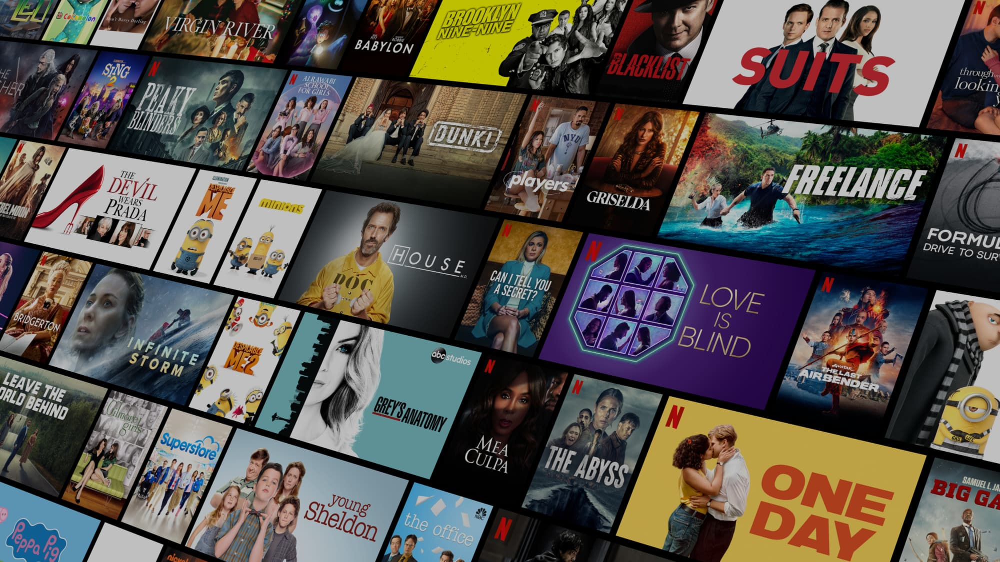

# 🎬 Netflix Clone

A responsive, full-featured Netflix UI clone built using **Next.js App Router**, **Tailwind CSS**, **Supabase** for authentication, and **TMDB API** for movie data.

## 🔥 Features

- 🏠 Home page with trending, top-rated, and action movies
- 🎥 Movie detail pages with backdrop, overview, rating, genres, and director
- 🔍 Search functionality for movies
- 📽️ Carousel for top movies using Swiper.js
- 🔐 Auth (Login/Signup) using Supabase
- 📺 "My List" to save favorite movies (upcoming)
- 🌙 Fully responsive dark UI using Tailwind CSS

---

## 🚀 Tech Stack

| Tech          | Description                                   |
|---------------|-----------------------------------------------|
| Next.js       | React framework with App Router architecture |
| Tailwind CSS  | Utility-first CSS framework                  |
| Supabase      | Auth and database backend                    |
| TMDB API      | Movie data source                            |
| Swiper.js     | Carousel for featured movies                 |

---
